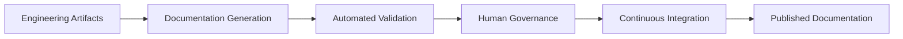
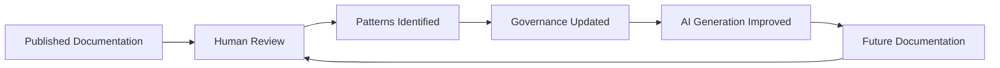

# Documentation Engineering
**Status:** Draft  
**Audience:** Documentation Architects, Developer Experience Teams, Technical Writers, Engineering Leadership  
**Document Type:** Architecture  
**Last Updated:** June 2026

---

# Executive Summary

Modern software engineering has fundamentally changed.

Engineering teams now use AI-assisted development, automated testing, continuous integration, and rapid deployment pipelines to ship software at a pace that was unimaginable only a few years ago. Features are implemented faster, APIs evolve more frequently, and release cycles continue to shorten.

Documentation, however, has largely remained unchanged.

Most documentation organizations still rely on a traditional editorial workflow in which individual technical writers manually author, review, revise, and publish content one page at a time. While this model has served the industry well for many years, it introduces a fixed throughput that does not scale with modern engineering practices. As engineering velocity increases, documentation debt grows automatically.

The challenge is no longer simply writing better documentation.

The challenge is designing a documentation system that scales at the same rate as engineering.

This document proposes a new operating model: **Documentation Delivery Architecture**.

Rather than treating documentation as a collection of independently authored pages, Documentation Delivery Architecture treats documentation as an engineered system composed of governed components, automated validation, AI-assisted authoring, and continuous delivery pipelines.

In this model:

- Engineering owns technical truth.
- AI transforms technical artifacts into documentation.
- Automated validation enforces consistency.
- Human experts govern standards rather than manually producing every page.
- Documentation is versioned, tested, reviewed, and deployed alongside code.

The result is documentation that scales with engineering rather than competing against it.

---

# The Scaling Problem

Traditional documentation organizations were designed for an era in which software changed relatively slowly.

A feature might be released every few months, documentation updates were infrequent, and a small editorial team could reasonably review every page before publication.

Modern software organizations operate very differently.

Continuous delivery pipelines, API-first architectures, microservices, and AI-assisted software development have dramatically increased engineering throughput. Individual teams may deploy production changes multiple times per day, while AI coding assistants accelerate implementation even further.

Documentation has not experienced the same transformation.

Many organizations continue to depend on a small number of technical writers who manually:

- Write documentation.
- Review documentation.
- Validate examples.
- Maintain screenshots.
- Enforce consistency.
- Publish content.

As product complexity grows, every one of these activities grows proportionally.

This creates a structural bottleneck.

Adding additional writers may temporarily increase throughput, but it does not fundamentally solve the scalability problem. Editorial consistency becomes increasingly difficult to maintain, knowledge becomes distributed across multiple contributors, and documentation quality begins to drift.

The underlying operating model has reached its natural limit.

---

# Documentation as an Engineering System

Documentation should be viewed as an engineering system rather than a publishing system.

Engineering already solves scalability through automation, repeatable processes, validation, and continuous integration.

Documentation should follow the same principles.

Instead of relying primarily on human memory and editorial judgment, documentation systems should define explicit rules that can be enforced automatically.

Examples include:

- Documentation Principles
- Content Models
- Style Guides
- Navigation Architecture
- Annotation Taxonomy
- Metadata Standards
- Canonical Examples
- Validation Rules

These artifacts become machine-readable governance rather than static reference material.

Once documentation standards become structured rules instead of institutional knowledge, AI systems can validate content automatically, engineering teams can participate more directly in documentation production, and human reviewers can focus their attention on architectural decisions rather than editorial repetition.

The role of documentation shifts from producing pages to designing and governing the system that produces those pages.

---

# Core Principles

Documentation Delivery Architecture is built upon several foundational principles.

## Documentation is Code

Documentation should be version-controlled, peer-reviewed, tested, and deployed using the same engineering practices applied to source code.

---

## Documentation Must Scale with Engineering

Increasing engineering velocity should not automatically increase documentation debt.

Documentation systems must be designed so that publishing capacity grows with engineering throughput rather than remaining constrained by individual editorial bandwidth.

---

## Governance Is More Valuable Than Production

Human expertise should be invested in defining standards, governing quality, and improving documentation systems rather than manually rewriting repetitive content.

Well-designed governance scales indefinitely.

Manual production does not.

---

## AI Should Accelerate, Not Replace, Documentation

Artificial intelligence should automate repetitive work while operating within clearly defined documentation standards.

AI generates.

Validation verifies.

Humans govern.

---

## Every Published Page Should Be Verifiable

Documentation should never rely solely on manual review.

Examples, schemas, links, terminology, metadata, and structural requirements should all be validated automatically wherever possible.

Automation should detect inconsistencies before publication rather than relying on readers to discover them afterward.

---

## Documentation Is a Product

Documentation should be treated as a first-class product with its own architecture, lifecycle, quality metrics, governance model, deployment pipeline, and continuous improvement process.

Like software itself, documentation should be designed to evolve safely, predictably, and continuously.

---

# Documentation Delivery Pipeline

Documentation Delivery Architecture treats documentation as a continuously delivered engineering artifact rather than a manually published editorial artifact.

Instead of relying on a technical writer to individually author, review, and publish every page, documentation flows through a governed pipeline. Each stage performs a specific function, with automation handling repetitive work and human reviewers providing governance where judgment is required.

The result is a documentation system that scales alongside engineering rather than becoming a bottleneck as engineering velocity increases.

---

# Pipeline Overview

The documentation delivery pipeline consists of six logical stages.

Each stage has clearly defined inputs, outputs, and responsibilities.

---

# Stage 1 — Engineering Artifacts

Every documentation pipeline begins with engineering.

Engineering is the authoritative source of technical truth.

Rather than asking technical writers to reverse engineer APIs after implementation, engineering produces structured artifacts alongside the software itself.

Typical engineering artifacts include:

- OpenAPI specifications
- JSON Schema definitions
- Protocol Buffer definitions
- Markdown implementation notes
- Release metadata
- Feature flags
- Configuration metadata
- Architecture Decision Records (ADRs)

These artifacts become the raw material from which documentation is produced.

> **Principle**
>
> Engineering owns technical truth.
>
> Documentation should consume engineering artifacts rather than attempting to recreate them manually.

---

# Stage 2 — Documentation Generation

Once engineering artifacts exist, an AI authoring system transforms those artifacts into human-readable documentation.

The authoring system does not invent technical behavior.

Instead, it applies the organization's documentation standards to existing technical information.

Examples of generated content include:

- API reference pages
- Capability guides
- Tutorials
- Release notes
- Migration guides
- Field descriptions
- Canonical JSON examples

Generation is governed by reusable templates and content models rather than free-form prompting.

> **Design Note**
>
> AI should generate documentation within a well-defined content model.
>
> Prompt engineering is significantly more reliable when the desired document structure is explicitly defined.

---

# Stage 3 — Automated Validation

Before documentation is reviewed or published, it passes through a series of automated validation checks.

Rather than asking reviewers to manually detect inconsistencies, the system verifies objective quality criteria.

Typical validation includes:

- Markdown syntax
- Broken links
- Metadata completeness
- Style guide compliance
- Terminology consistency
- OpenAPI alignment
- JSON schema validation
- Example payload validation
- Navigation consistency
- Accessibility requirements

Any validation failures prevent publication until corrected.

> **Implementation Note**
>
> Automated validation should focus on objective, repeatable rules.
>
> Human reviewers should spend their time evaluating clarity, completeness, and architectural quality rather than formatting or syntax.

---

# Stage 4 — Human Governance

Human reviewers remain an essential part of the documentation system.

Their role, however, changes significantly.

Instead of producing documentation line by line, reviewers govern the system that produces documentation.

Responsibilities include:

- Maintaining the Content Model
- Maintaining the Style Guide
- Updating Documentation Principles
- Improving AI instructions
- Reviewing architectural decisions
- Resolving validation exceptions
- Approving publication

The emphasis shifts from production to governance.

> **Design Note**
>
> Human expertise scales most effectively when invested in improving the system rather than repeatedly performing the same editorial tasks.

---

# Stage 5 — Continuous Integration

Documentation enters the same continuous integration process used for application code.

Every documentation update becomes a version-controlled change that can be:

- Reviewed
- Tested
- Validated
- Approved
- Deployed

Engineering changes that affect public behavior should require corresponding documentation updates before merge.

This creates a direct relationship between software releases and documentation quality.

Documentation is no longer an afterthought.

It becomes part of the definition of done.

---

# Stage 6 — Publication

Once validation succeeds and required approvals are complete, documentation is automatically published.

Publication targets may include:

- Developer portals
- Documentation websites
- Internal knowledge bases
- SDK reference sites
- API reference portals

Because documentation is generated from governed content rather than manually assembled pages, publication becomes a predictable deployment process rather than a separate editorial activity.

---

# Human Responsibilities Throughout the Pipeline

Documentation Delivery Architecture does not eliminate technical writers.

It elevates their role.

Instead of acting primarily as content producers, documentation professionals become architects, governors, and quality engineers responsible for improving the documentation system itself.

Their responsibilities include:

- Designing documentation architecture
- Defining content standards
- Governing terminology
- Creating reusable templates
- Building AI workflows
- Improving validation rules
- Monitoring documentation quality
- Continuously refining the delivery pipeline

As the documentation system matures, the proportion of effort spent writing individual pages decreases while the proportion spent improving the documentation ecosystem increases.

---

# Key Characteristics

A mature Documentation Delivery Architecture demonstrates several defining characteristics.

- Documentation is version controlled.
- Documentation is generated from structured technical artifacts.
- AI accelerates production but does not define standards.
- Validation occurs before publication.
- Human reviewers govern quality rather than manually editing every page.
- Documentation is deployed alongside software releases.
- Documentation quality improves continuously through feedback into the system.

Collectively, these characteristics transform documentation from a manual publishing process into a scalable engineering capability capable of supporting modern software development.

---

# The Governance Layer

Automation does not eliminate the need for documentation standards.

In fact, automation makes them more important.

Artificial intelligence can only produce consistent documentation when it operates within a clearly defined governance framework. Without explicit standards, AI systems generate documentation that varies in organization, terminology, completeness, and quality. The result is documentation drift—the same problem organizations experience with multiple human authors, only at greater speed.

Documentation Delivery Architecture addresses this challenge by establishing a machine-readable governance layer.

Rather than relying on institutional knowledge or editorial judgment, documentation quality is defined through explicit rules that both humans and automated systems can understand.

These governance artifacts collectively define what "good documentation" means for an organization.

---

# Documentation as a Contract

Within Documentation Delivery Architecture, documentation standards are treated as a contract rather than a collection of recommendations.

Every document entering the pipeline is expected to satisfy the requirements defined by the governance layer before publication.

Instead of asking reviewers questions such as:

- "Does this page look right?"
- "Does this feel consistent?"
- "Is this enough detail?"

the pipeline evaluates measurable standards.

For example:

- Does the page follow the appropriate template?
- Are required sections present?
- Does terminology match the approved registry?
- Are canonical examples valid?
- Are required annotations included?
- Does the page satisfy the Documentation Principles?

By transforming subjective editorial decisions into objective validation rules, documentation quality becomes repeatable and scalable.

---

# Governance Components

The governance layer is composed of several complementary artifacts.

Each artifact defines one aspect of documentation quality.

| Artifact | Purpose |
|----------|---------|
| Documentation Principles | Defines the philosophy and architectural principles governing all documentation. |
| Documentation Style Guide | Establishes writing conventions, tone, terminology, formatting, and editorial standards. |
| Content Model | Defines page types, required sections, reusable components, and content structure. |
| Annotation Taxonomy | Standardizes Design Notes, Implementation Notes, Security Notes, Best Practices, and other reusable annotations. |
| Navigation Architecture | Defines how information is organized and discovered. |
| Metadata Standard | Defines structured page metadata used for filtering, search, and AI retrieval. |
| Documentation Maturity Model | Measures documentation quality and organizational maturity over time. |
| Publication Review Framework | Defines objective readiness criteria prior to publication. |
| Canonical Examples | Provides authoritative request, response, and workflow examples used throughout the documentation. |

Together, these artifacts form the documentation contract that governs every published page.

---

# Governance Is Machine-Readable

Traditional documentation standards are written primarily for humans.

Documentation Delivery Architecture extends this concept by defining standards in a way that automated systems can evaluate.

For example, an automated validation agent should be able to determine whether:

- A required "Learning Objectives" section is missing.
- A tutorial omits prerequisite information.
- An API reference lacks canonical request examples.
- Required metadata fields are absent.
- A page violates terminology standards.
- A Design Note is required but missing.

Because governance artifacts define explicit expectations, automated validation becomes practical and reliable.

> **Design Note**
>
> Governance documents should describe rules rather than preferences.
>
> Objective rules can be enforced automatically. Subjective preferences cannot.

---

# Human Judgment Still Matters

Not every aspect of documentation can—or should—be automated.

Automation is highly effective at enforcing objective standards, but human reviewers remain responsible for evaluating qualities that require context, experience, or professional judgment.

Examples include:

- Is the explanation understandable?
- Does the tutorial teach concepts in an effective sequence?
- Are implementation decisions clearly explained?
- Does the page support the intended audience?
- Is the overall learning experience coherent?

Automation verifies compliance.

Humans evaluate communication.

These responsibilities complement one another rather than compete.

---

# Governance Improves AI

One of the greatest misconceptions surrounding AI-assisted documentation is that better prompts produce better documentation.

While prompt quality is important, the largest improvements typically come from stronger governance rather than more sophisticated prompting.

When AI operates within a mature documentation framework, it benefits from:

- Clearly defined page templates.
- Consistent terminology.
- Reusable annotation patterns.
- Canonical examples.
- Explicit documentation principles.
- Structured metadata.
- Objective publication criteria.

The result is documentation that becomes progressively more consistent over time.

Improving the governance layer improves every document produced by the system.

---

# Continuous Improvement

The governance layer is not static.

As documentation evolves, governance artifacts evolve alongside it.

When reviewers repeatedly identify similar issues, the preferred response is not simply to correct the affected pages.

Instead, the governance layer should be improved so that future documentation avoids the same issue automatically.

Examples include:

- Updating the Style Guide to clarify ambiguous wording.
- Expanding the Content Model to introduce a reusable section.
- Creating a new annotation type.
- Adding a validation rule.
- Introducing a new canonical example.
- Refining AI authoring instructions.

This feedback loop transforms documentation quality from a reactive editorial process into a continuously improving engineering system.

---

# Governance Feedback Loop

The governance layer itself evolves through continuous feedback.

Rather than correcting the same issue repeatedly, improvements are made once within the governance framework and automatically influence future documentation produced by the pipeline.

This allows documentation quality to improve systematically rather than incrementally.

---

# The Role of the Documentation Architect

Within Documentation Delivery Architecture, the documentation architect becomes the steward of the governance layer.

Rather than acting primarily as an editor or content producer, the documentation architect is responsible for designing, maintaining, and evolving the documentation system itself.

Typical responsibilities include:

- Defining documentation principles.
- Maintaining the Content Model.
- Designing page templates.
- Governing terminology.
- Defining validation rules.
- Reviewing architectural decisions.
- Improving AI workflows.
- Measuring documentation quality.

As the documentation system matures, the architect spends less time producing individual documents and more time improving the framework that produces them.

This shift—from document author to documentation systems architect—is what enables documentation organizations to scale alongside modern engineering teams without sacrificing quality or consistency.

---

# Operating Model

Documentation Delivery Architecture is more than a technical pipeline.

It represents a shift in how documentation organizations operate.

Historically, technical writers have been responsible for manually researching, writing, reviewing, editing, and publishing documentation. As engineering organizations grow, this model becomes increasingly difficult to sustain. Every new API, feature, integration, or product increases the amount of documentation that must be created and maintained.

Documentation Delivery Architecture redistributes these responsibilities across engineering, automation, and documentation governance.

Rather than asking documentation teams to manually produce every page, the organization defines clear ownership boundaries that allow each discipline to contribute where it provides the greatest value.

The result is an operating model in which documentation quality improves while documentation production becomes increasingly automated.

---

# Shared Ownership

Documentation is no longer owned exclusively by the documentation team.

Instead, responsibility is shared across three primary functions.

| Function | Primary Responsibility |
|----------|------------------------|
| Engineering | Owns technical truth. |
| AI Systems | Transform structured technical information into documentation. |
| Documentation Architects | Govern quality, standards, and information architecture. |

Each group contributes a different form of expertise.

Engineering understands how the software works.

AI systems transform structured technical information into readable documentation.

Documentation architects ensure that every published page communicates effectively, remains consistent with organizational standards, and supports the needs of its intended audience.

---

# Engineering Owns Technical Truth

Engineering should remain the authoritative source for how the platform behaves.

Rather than describing APIs after implementation, engineering teams produce structured artifacts as part of the software development process.

Examples include:

- OpenAPI specifications
- JSON Schema definitions
- Architecture Decision Records (ADRs)
- Release metadata
- Feature flags
- Configuration schemas
- Protocol definitions

These artifacts become the canonical source of technical truth for the documentation pipeline.

This approach reduces ambiguity, eliminates duplicate effort, and ensures that documentation remains aligned with the implementation.

> **Design Note**
>
> Documentation should consume technical truth rather than recreate it.
>
> When engineering artifacts become the authoritative source of system behavior, documentation can evolve automatically alongside the software.

---

# AI Produces Documentation

Artificial intelligence serves as the production engine within the documentation system.

Rather than replacing technical writers, AI performs the repetitive transformation of structured technical information into documentation that conforms to the organization's standards.

Typical AI-generated artifacts include:

- API reference pages
- Capability guides
- Tutorials
- Release notes
- Field descriptions
- Canonical examples
- Migration guides

AI generation is governed by the organization's Documentation Principles, Content Model, Style Guide, Annotation Taxonomy, and Metadata Standards.

Without these governance artifacts, AI simply produces text.

With them, AI produces documentation that is consistent, predictable, and aligned with organizational expectations.

> **Implementation Note**
>
> AI should generate documentation from structured inputs whenever possible.
>
> Structured engineering artifacts produce more reliable documentation than free-form prompts or manually written notes.

---

# Documentation Architects Govern the System

The documentation architect becomes the steward of the documentation ecosystem.

Instead of spending the majority of their time writing individual pages, documentation architects focus on improving the systems that produce documentation.

Typical responsibilities include:

- Maintaining Documentation Principles
- Designing the Content Model
- Governing terminology
- Defining annotation standards
- Creating reusable templates
- Improving AI workflows
- Maintaining validation rules
- Reviewing architectural consistency
- Measuring documentation quality

As governance improves, every document produced by the pipeline improves as well.

This creates a multiplier effect that cannot be achieved through manual editing alone.

---

# Publication Becomes Continuous

Documentation should move through the same delivery pipeline as software.

Engineering changes should trigger documentation updates automatically.

Before publication, documentation passes through a series of automated quality gates, including:

- Schema validation
- Link validation
- Style validation
- Terminology checks
- Metadata verification
- Example validation
- Content Model compliance
- Accessibility checks

Only documentation that satisfies these requirements proceeds to human review and publication.

Documentation quality therefore becomes an objective property of the pipeline rather than the sole responsibility of individual reviewers.

---

# Human Review Evolves

Human review remains essential.

Its purpose, however, changes significantly.

Traditional review focuses on finding formatting inconsistencies, correcting grammar, and verifying individual examples.

Documentation Delivery Architecture shifts human review toward higher-value activities.

Reviewers evaluate questions such as:

- Does this page teach effectively?
- Does the workflow make sense?
- Are implementation decisions clearly explained?
- Is the intended audience well supported?
- Does the documentation accurately represent the product experience?

Objective issues are handled by automation.

Human reviewers focus on communication, architecture, and developer experience.

> **Design Note**
>
> Automation verifies compliance.
>
> Humans evaluate understanding.

---

# Documentation as Part of the Definition of Done

Documentation should not be treated as a post-development activity.

Instead, documentation becomes part of the software delivery lifecycle.

A feature is not considered complete until:

- Engineering artifacts are complete.
- Documentation has been generated.
- Validation has succeeded.
- Required reviews have been completed.
- Documentation is ready for publication.

This aligns documentation with engineering rather than placing it downstream of engineering.

The result is documentation that ships with the software instead of following it weeks or months later.

---

# Measuring Success

Because documentation is produced through a governed pipeline, quality becomes measurable.

Organizations can monitor metrics such as:

- Documentation coverage
- Validation pass rates
- Broken link counts
- Terminology consistency
- Example validation success
- Time from feature completion to documentation publication
- Documentation freshness
- Documentation reuse
- AI generation success rates

These metrics provide objective insight into documentation health and identify opportunities for continuous improvement.

---

# Organizational Benefits

Documentation Delivery Architecture changes the role of documentation within an organization.

Instead of functioning as a publishing department, documentation becomes an engineering capability that supports the entire software delivery lifecycle.

Benefits include:

- Documentation scales with engineering growth.
- Technical truth remains synchronized with implementation.
- Documentation quality becomes measurable.
- AI accelerates production without reducing governance.
- Editorial consistency improves over time.
- Human expertise is invested where it creates the greatest value.
- Documentation becomes easier to maintain as systems evolve.

Organizations adopting this operating model move from treating documentation as a collection of documents to treating it as a continuously improving knowledge system.

The long-term result is documentation that is more accurate, more consistent, more maintainable, and better aligned with the pace of modern software engineering.
