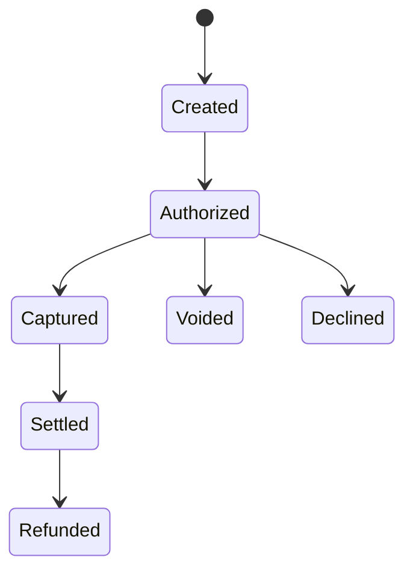

# Payments API

**Page Type:** Reference  
**API Area:** Payments  
**Status:** Draft

The Payments API allows applications to create, retrieve, and manage payment transactions through Atlas Commerce.

Use this reference when you need exact endpoint details, request fields, response fields, status values, and error models for payment operations. If you are new to Atlas Commerce payments, start with **Accept Your First Payment** before using this reference.

---

# Overview

A payment represents an attempt to move money from a customer to a merchant.

Payments may be created for common commerce workflows such as checkout, invoice payment, subscription billing, order fulfillment, and marketplace transactions. Atlas Commerce normalizes payment processing into a consistent API model so that applications can submit payment requests, interpret responses, and manage follow-up actions using predictable structures.

The Payments API supports the following core operations:

| Operation | Description |
|----------|-------------|
| Create a payment | Submit a new payment authorization or sale request. |
| Retrieve a payment | Get the current status and details of an existing payment. |
| Capture a payment | Capture a previously authorized payment. |
| Void a payment | Cancel an eligible payment before settlement. |
| Refund a payment | Return funds for a completed payment. |

This reference focuses first on **Create a payment**, because it is the foundational payment operation used throughout Atlas Commerce.

---

# Base URLs

Atlas Commerce provides separate base URLs for Sandbox and Production.

| Environment | Base URL |
|-------------|----------|
| Sandbox | `https://api.sandbox.atlas-commerce.example` |
| Production | `https://api.atlas-commerce.example` |

Use Sandbox while developing and testing your integration. Use Production only when processing live transactions.

---

# Authentication

All Payments API requests require OAuth bearer token authentication.

Include the access token in the HTTP `Authorization` header.

```http
Authorization: Bearer <access_token>

Payment creation requires the following scope:

```text
payments:write
```

Retrieving payment details requires:

```text
payments:read
```

For more information about obtaining access tokens and configuring application scopes, see the **Authentication** guide.

---

# Create a Payment

Creates a new payment transaction.

A payment request authorizes (and, depending on the transaction type, captures) funds from a customer's payment method.

Use this operation whenever your application needs to initiate a new payment.

---

## Endpoint

```http
POST /v1/payments
```

---

## HTTP Method

```text
POST
```

---

## Authentication

Bearer Token (OAuth 2.1)

Required scope:

```text
payments:write
```

---

## Content Type

```http
Content-Type: application/json
```

---

## Accept

```http
Accept: application/json
```

---

# Request Overview

A payment request consists of three primary sections.

| Section | Purpose |
|----------|---------|
| Workflow | Identifies and tracks the request. |
| Credentials | Identifies the merchant processing the payment. |
| Payment | Contains the transaction being authorized. |

The request is intentionally organized around business concepts rather than processor-specific implementation details.

---

# Request Structure

```text
Payment Request
│
├── workflow
│
├── credentials
│
└── payment
    │
    ├── merchantReference
    ├── transactionType
    ├── amount
    ├── paymentMethod
    └── metadata (optional)
```

This structure remains consistent across Atlas Commerce payment operations, allowing developers to reuse the same mental model as additional capabilities are introduced.

---

# Canonical Request

The following example demonstrates the smallest successful payment request.

```json
{
  "workflow": {
    "requestId": "req_01J5RZKQ5T4Y8W7X9A2B3C4D5E"
  },
  "credentials": {
    "merchantId": "merchant_demo",
    "terminalId": "terminal_001"
  },
  "payment": {
    "merchantReference": "ORDER-100045",
    "transactionType": "sale",
    "amount": {
      "currency": "USD",
      "value": 42.50
    },
    "paymentMethod": {
      "cardNumber": "4111111111111111",
      "expirationMonth": "12",
      "expirationYear": "2030",
      "securityCode": "123"
    }
  }
}
```

This example intentionally includes only the fields required to perform a basic payment authorization. More advanced capabilities—such as stored payment methods, digital wallets, installment payments, and recurring billing—extend this request model rather than replacing it.

---

# Request Fields

The following table summarizes the top-level request objects.

| Field | Required | Description |
|--------|:--------:|-------------|
| `workflow` | ✓ | Information used to identify and track the request. |
| `credentials` | ✓ | Merchant account information used to process the transaction. |
| `payment` | ✓ | The payment transaction being submitted. |

Subsequent sections describe each object and its child fields in detail.

---

# Field Reference

The Create Payment request is composed of three primary objects.

Rather than documenting every field alphabetically, Atlas Commerce documents fields in the order they appear within the request. This approach mirrors how developers naturally construct requests and makes it easier to understand the relationship between fields.

---

# workflow

The `workflow` object contains information used to uniquely identify and track the request.

Although this object is relatively small, it plays an important role in request tracing, duplicate detection, and operational troubleshooting.

| Field | Type | Required | Description |
|--------|------|:--------:|-------------|
| `requestId` | String | ✓ | Unique identifier for this payment request. |

### Example

```json
{
  "workflow": {
    "requestId": "req_01J5RZKQ5T4Y8W7X9A2B3C4D5E"
  }
}
```

> **Design Note**
>
> Atlas Commerce separates workflow information from business data.
>
> The `workflow` object contains metadata about **the request itself**, not the payment being processed.
>
> This separation allows request tracking, logging, idempotency, and operational tooling to evolve independently from the payment schema.

---

# credentials

The `credentials` object identifies the merchant account responsible for processing the payment.

These values are assigned during merchant onboarding and typically remain stable for a given merchant environment.

| Field | Type | Required | Description |
|--------|------|:--------:|-------------|
| `merchantId` | String | ✓ | Merchant account identifier. |
| `terminalId` | String | ✓ | Merchant terminal processing the transaction. |

### Example

```json
{
  "credentials": {
    "merchantId": "merchant_demo",
    "terminalId": "terminal_001"
  }
}
```

> **Design Note**
>
> Merchant credentials are grouped into their own object because they describe **who is processing the payment**, not the payment itself.
>
> Keeping merchant identity separate from transaction details allows multiple merchants, terminals, or business units to share the same payment model without changing the request structure.

---

# payment

The `payment` object contains the business information required to authorize the transaction.

Unlike the `workflow` and `credentials` objects, which describe the request and merchant, the `payment` object describes the financial transaction itself.

| Field | Type | Required | Description |
|--------|------|:--------:|-------------|
| `merchantReference` | String | ✓ | Merchant-generated identifier for the transaction. |
| `transactionType` | Enum | ✓ | Type of payment operation to perform. |
| `amount` | Object | ✓ | Currency and transaction amount. |
| `paymentMethod` | Object | ✓ | Customer payment method. |
| `metadata` | Object | No | Optional merchant-defined information associated with the transaction. |

> **Design Note**
>
> Atlas Commerce intentionally groups all transaction-specific information into a single object.
>
> This keeps payment business logic isolated from authentication, workflow management, and merchant configuration while making the request easier to understand and extend over time.

---

# merchantReference

The merchant reference uniquely identifies the payment within your own business systems.

Atlas Commerce stores and returns this value exactly as provided.

Many merchants use merchant references for:

- Order numbers
- Invoice numbers
- Reservation identifiers
- Customer reference numbers

### Example

```json
{
  "merchantReference": "ORDER-100045"
}
```

> **Best Practice**
>
> Use values that are meaningful within your business.
>
> Merchant references simplify reconciliation, reporting, customer support, and troubleshooting.

> **Design Note**
>
> Atlas Commerce does not generate merchant references because only the merchant understands the business context of a transaction.
>
> Returning the merchant reference in subsequent API responses allows applications to correlate Atlas Commerce transactions with internal business records.

---

# transactionType

The transaction type determines how Atlas Commerce processes the payment.

For this guide, the recommended value is:

```text
sale
```

Typical transaction types include:

| Value | Description |
|--------|-------------|
| `sale` | Authorize and capture funds in a single operation. |
| `authorize` | Reserve funds without capturing them. |
| `capture` | Capture a previously authorized payment. |
| `refund` | Return funds to the customer. |
| `void` | Cancel an eligible payment before settlement. |

> **Design Note**
>
> Atlas Commerce models payment operations as transaction types rather than separate APIs whenever possible.
>
> This allows developers to reuse a consistent request model while supporting a broad range of payment workflows.

---

# amount

The `amount` object specifies the monetary value of the transaction.

| Field | Type | Required | Description |
|--------|------|:--------:|-------------|
| `currency` | String | ✓ | Three-letter ISO 4217 currency code. |
| `value` | Decimal | ✓ | Transaction amount. |

### Example

```json
{
  "amount": {
    "currency": "USD",
    "value": 42.50
  }
}
```

> **Design Note**
>
> Atlas Commerce groups currency and value together because a numeric amount has no meaning without its associated currency.
>
> Treating them as a single object reduces ambiguity and simplifies support for multi-currency payment processing.

---

# paymentMethod

The `paymentMethod` object identifies how the customer will pay.

This tutorial uses a basic payment card.

Future guides demonstrate additional payment methods, including:

- Stored payment methods
- Digital wallets
- Bank accounts
- Alternative payment methods

| Field | Type | Required | Description |
|--------|------|:--------:|-------------|
| `cardNumber` | String | ✓ | Primary account number (Sandbox only). |
| `expirationMonth` | String | ✓ | Card expiration month. |
| `expirationYear` | String | ✓ | Card expiration year. |
| `securityCode` | String | ✓ | Card verification value. |

### Example

```json
{
  "paymentMethod": {
    "cardNumber": "4111111111111111",
    "expirationMonth": "12",
    "expirationYear": "2030",
    "securityCode": "123"
  }
}
```

> **Sandbox Only**
>
> The payment card values shown in this documentation are test data intended exclusively for use in the Atlas Commerce Sandbox environment.

> **Design Note**
>
> Atlas Commerce models payment methods as interchangeable objects.
>
> As new payment methods are introduced—such as wallets, payment tokens, or bank transfers—the surrounding payment request remains unchanged.
>
> This allows applications to evolve incrementally while preserving a consistent integration model.

---

# Responses

After successfully validating the request and processing the transaction, Atlas Commerce returns an HTTP response describing the outcome of the operation.

Responses follow a consistent structure across all Atlas Commerce APIs.

Every response contains:

- An HTTP status code
- A JSON response body
- A consistent resource model
- Error information (when applicable)

This consistency allows applications to process responses predictably regardless of the API being called.

> **Design Note**
>
> Atlas Commerce uses a consistent response model across all APIs rather than allowing each service to define its own response structure.
>
> This reduces implementation complexity, simplifies SDK development, and creates a more predictable developer experience.

---

# Successful Responses

A successful payment request returns one of the following HTTP status codes.

| Status Code | Meaning |
|-------------|---------|
| `200 OK` | The request completed successfully. |
| `201 Created` | A new payment resource was successfully created. |

Payment creation operations typically return **201 Created** because a new payment resource has been created.

---

# Example Response

```http
HTTP/1.1 201 Created
Content-Type: application/json
```

```json
{
  "paymentId": "pay_123456789",
  "merchantReference": "ORDER-100045",
  "status": "authorized",
  "amount": {
    "currency": "USD",
    "value": 42.50
  },
  "authorizationCode": "A34781",
  "created": "2026-06-23T15:42:18Z"
}
```

---

# Response Fields

| Field | Type | Description |
|---------|------|-------------|
| `paymentId` | String | Atlas Commerce identifier for the payment. |
| `merchantReference` | String | Merchant-supplied transaction reference. |
| `status` | Enum | Current payment status. |
| `amount` | Object | Authorized payment amount. |
| `authorizationCode` | String | Authorization code returned by the payment processor. |
| `created` | Timestamp | Time the payment was created. |

---

# paymentId

The `paymentId` uniquely identifies the payment within Atlas Commerce.

Unlike the `merchantReference`, which originates from your own systems, the `paymentId` is generated by Atlas Commerce and is used by subsequent payment operations.

You'll use this identifier when:

- Retrieving payment details
- Capturing an authorization
- Issuing a refund
- Voiding a payment
- Reviewing transaction history

> **Implementation Note**
>
> Store the `paymentId` immediately after creating a payment.
>
> Most follow-on payment operations reference this identifier rather than the original request payload.

---

# status

The `status` field describes the current state of the payment.

For this tutorial, the expected value is:

```text
authorized
```

Additional payment workflows introduce other status values.

| Status | Description |
|---------|-------------|
| `authorized` | Funds have been approved by the issuer. |
| `captured` | Funds have been captured for settlement. |
| `settled` | The payment has completed settlement. |
| `refunded` | Funds have been returned to the customer. |
| `declined` | The issuer declined the payment. |
| `voided` | The authorization was cancelled before settlement. |

> **Design Note**
>
> Atlas Commerce models payment status as the current state of a payment resource rather than exposing processor-specific status values.
>
> This provides a stable integration model even when underlying processors differ in terminology or implementation.

---

# Payment Lifecycle

Payments progress through a lifecycle.

Not every payment reaches every state.



The payment status reflects where the transaction currently exists within this lifecycle.

Understanding these states simplifies reporting, customer support, reconciliation, and downstream payment operations.

---

# Common Error Responses

If Atlas Commerce cannot process the request, an appropriate HTTP status code and standardized error response are returned.

| Status Code | Meaning |
|-------------|---------|
| `400 Bad Request` | Request validation failed. |
| `401 Unauthorized` | Authentication failed. |
| `403 Forbidden` | Required scope is missing. |
| `404 Not Found` | Requested resource does not exist. |
| `409 Conflict` | Duplicate or conflicting request. |
| `422 Unprocessable Entity` | Business validation failed. |
| `500 Internal Server Error` | Unexpected server error. |

---

# Example Error Response

```http
HTTP/1.1 400 Bad Request
```

```json
{
  "error": {
    "code": "validation_failed",
    "message": "The payment amount must be greater than zero.",
    "field": "payment.amount.value"
  }
}
```

Atlas Commerce returns structured error information designed to help developers quickly identify and resolve integration issues.

> **Design Note**
>
> Validation errors identify the specific field responsible whenever practical.
>
> Precise error reporting reduces troubleshooting time and improves the developer experience.

---

# Error Handling Recommendations

Applications should distinguish between authentication failures, validation errors, business declines, and unexpected server failures.

Recommended handling includes:

- Retry transient server failures when appropriate.
- Correct validation errors before resubmitting requests.
- Prompt customers for another payment method when transactions are declined.
- Never retry authentication failures without obtaining a new access token.

> **Implementation Note**
>
> HTTP status codes indicate whether the request succeeded technically.
>
> Business decisions should always be based on both the HTTP status code and the contents of the response body.

---

# Related Guides

The Payments API is only one part of the overall payment lifecycle.

For complete implementation guidance, see:

- **Accept Your First Payment**
- **Authentication**
- **Refunds**
- **Capture a Payment**
- **Void a Payment**
- **Error Handling**

These guides explain when and why to use each payment operation within a complete commerce workflow.
